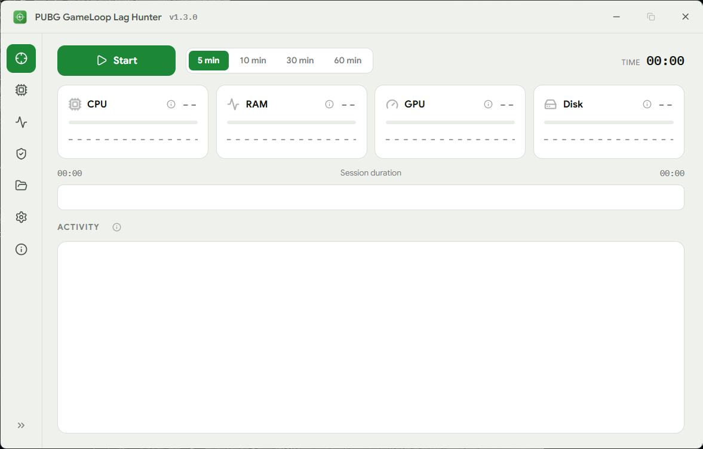

# PUBG GameLoop Lag Hunter

**A Windows performance analyzer for PUBG Mobile on GameLoop that monitors gameplay, detects stutters, and identifies their root causes.**


---

## See It in Action

Live monitoring during a scan, CPU, RAM, GPU, and disk every second, with the session timeline and activity feed. Dark and light themes included.

<p align="center">
  
</p>

---

## Why

Lag in PUBG Mobile on an emulator is rarely caused by a single thing.

It can be a **disk paging storm**, a **processor throttling under heat**, or a **GPU waking from power-saving at the wrong moment**.

Most tools show numbers.

**Lag Hunter shows what happened.**

It monitors CPU, RAM, GPU, and disk activity during gameplay, then identifies the events associated with detected stutters and explains the diagnosis in plain language.

---

## How to Use

**1. Start the game**

Open GameLoop and start PUBG Mobile.

**2. Start monitoring**

Press **Start**. If the game isn't running yet, the tool tells you.

**3. Play normally**

CPU, RAM, GPU, and disk are sampled every second while you play.

**4. Read the diagnosis**

Stop the scan, or let auto-stop finish it, and review the findings, key moments, and measurements.

The **Reports** tab keeps every finished session with its full report. **System** shows your rig as the tool sees it, **Processes** shows what's eating the machine right now, and **Checks** points at Windows settings that silently cause lag (it only opens the right page, you flip the switch).

> **Read-only by design:** Lag Hunter diagnoses and advises. It never changes Windows settings.

---

## What It Costs Your Machine

| Resource |                   Usage |
| -------- | ----------------------: |
| CPU      | Under 1% while scanning |
| RAM      |                  ~25 MB |
| Disk     |      ~200 KB per minute |
| Sessions |      Stop automatically |

---

## Requirements

* **Windows 10 or 11 (64-bit)**
* **GameLoop with PUBG Mobile**
* **NVIDIA GPU** for GPU counters

On AMD/Intel, GPU counter availability is limited. The tool reports this honestly and continues measuring everything else.

The interface speaks **English and Arabic**, with a **dark and light theme** (Settings tab).

---

## Download

Download `pubg-gameloop-lag-hunter-<version>.exe` from the [Releases](https://github.com/Ahmed-Hawass/pubg-gameloop-lag-hunter/releases) page and run it.

For example:

```text
pubg-gameloop-lag-hunter-1.5.0.exe
```

**No installer. No setup.**

Every release includes `SHA256SUMS.txt` so you can verify the downloaded file.

The app also checks for updates itself and offers new releases from inside the About tab, same signed-by-hash files, no auto-install, no restart.

### First Run on Windows 10

The app requires Microsoft's free **WebView2 Runtime**.

If it isn't installed, the app tells you and opens the official Microsoft download page.

The downloader is ~2 MB. The full runtime requires a few hundred MB of disk space.

Windows 11 has WebView2 built in.

### SmartScreen

The executable is currently **unsigned** because this is an independent project.

Windows may therefore show a blue **"Windows protected your PC"** warning on the first run.

If you trust the downloaded release:

**More info → Run anyway**

Each release also provides a SHA-256 hash for verification.

### Local Data

All application data lives in:

```text
%LOCALAPPDATA%\LagHunter\
```

Delete this folder to remove the locally stored application data.

---

## Build from Source

```bash
git clone https://github.com/Ahmed-Hawass/pubg-gameloop-lag-hunter.git
cd pubg-gameloop-lag-hunter
npm install
npx tauri dev
```

### Prerequisites

* [Node.js 22+](https://nodejs.org/) (the version CI builds and tests with)
* [Rust 1.77+](https://rustup.rs/) with the MSVC toolchain

### Release Build

```bash
npx tauri build --no-bundle
```

Binary:

```text
src-tauri/target/release/pubg-gameloop-lag-hunter-<version>.exe
```

The exe is already versioned, attach it to the release as-is.

---

## Going Deeper

* [Architecture](docs/ARCHITECTURE.md): how the engine is built and why
* [CLI and headless testing](docs/CLI.md): running the engine without the window
* [Specification](docs/SPEC.md): product guarantees and non-goals
* [Changelog](CHANGELOG.md)

---

## Contributing

Issues and pull requests are welcome.

For engineering ground rules, see [CONTRIBUTING.md](CONTRIBUTING.md).

---

## Support

Lag Hunter is free and independent. If it helped you find your stutter, you can support its development here:

**[paypal.me/ahmedhawass](https://paypal.me/ahmedhawass)**

---

## License

[MIT](LICENSE)

**Made with 💚 by Ahmed Hawass**
