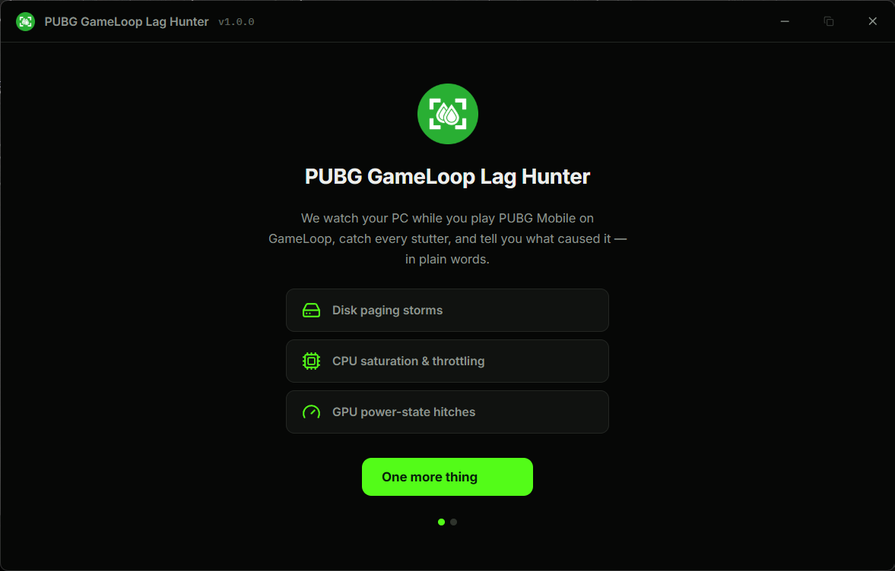
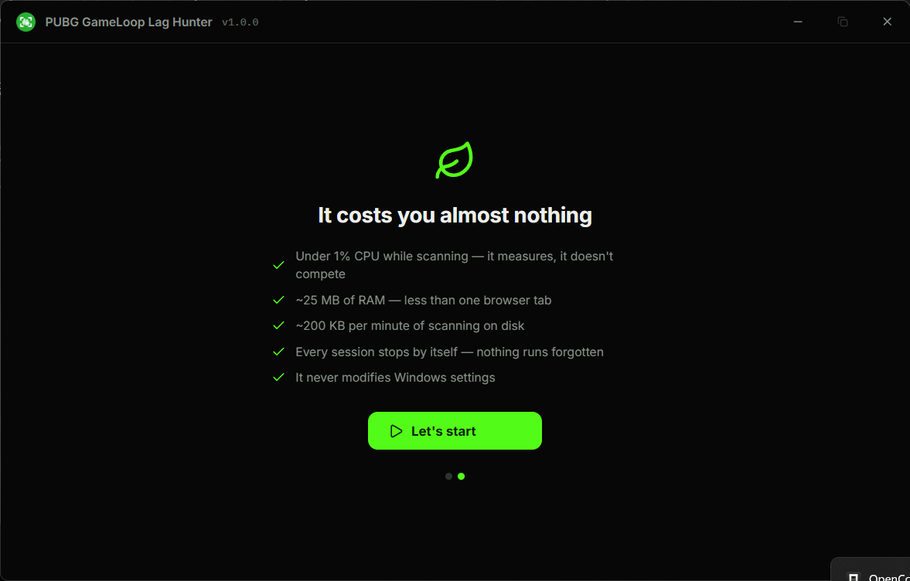
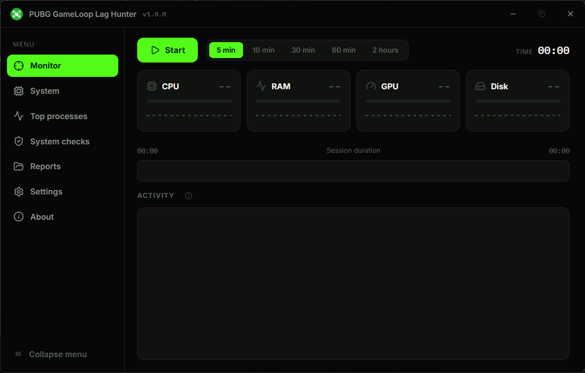
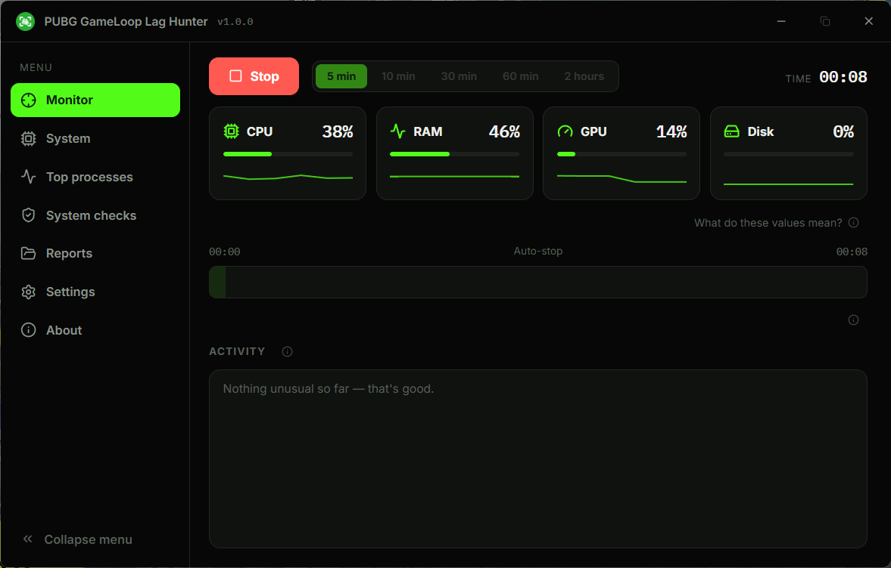
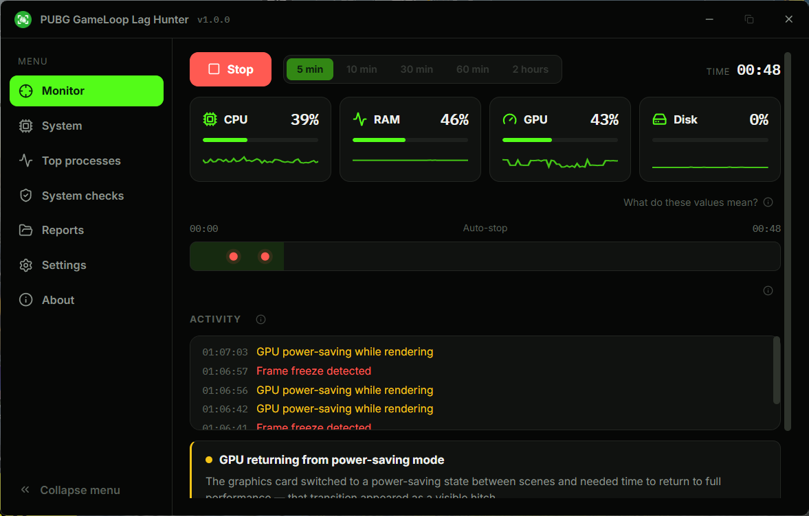

# PUBG GameLoop Lag Hunter

A Windows tool that watches your PC while you play PUBG Mobile on GameLoop, catches every stutter, and tells you what caused it and how to fix it — in plain language, English or Arabic.

  

## Screenshots

The first-run welcome, a live scan, and a diagnosis explained in plain words — click any shot to view it full size.

<p align="center">
  <a href="docs/screenshots/welcome-1.png"></a>
  &nbsp;
  <a href="docs/screenshots/welcome-2.png"></a>
  &nbsp;
  <a href="docs/screenshots/monitor-idle.png"></a>
  &nbsp;
  <a href="docs/screenshots/monitor-live.png"></a>
  &nbsp;
  <a href="docs/screenshots/monitor-diagnosis.png"></a>
</p>

## Why

Lag in PUBG Mobile on an emulator is almost never one thing. It's a disk paging storm during hot drops, a processor throttling under heat, a GPU waking from power-saving at the worst moment. Most tools show numbers. This one tells you which of those actually happened, how bad it was, and what to do about it.

## How to use

1. Open GameLoop and start PUBG Mobile — the Start button lights up by itself.
2. Press **Start** and play. CPU, RAM, GPU, and disk are sampled every second.
3. Stop (or let auto-stop finish it) and read the report: findings, key moments, and the numbers — in plain words.

The tool is read-only on your system. It diagnoses and advises; it never changes Windows settings.

## What it costs your machine

- Under 1% CPU while scanning
- ~25 MB of RAM
- ~200 KB per minute on disk
- Every session stops by itself

## Requirements

- Windows 10 or 11 (64-bit)
- GameLoop with PUBG Mobile
- An NVIDIA GPU unlocks GPU counters; on AMD/Intel the tool says so honestly and keeps measuring everything else

## Download

Download `pubg-gameloop-lag-hunter-<version>.exe` (e.g. `pubg-gameloop-lag-hunter-1.0.0.exe`) from the [releases page](https://github.com/Ahmed-Hawass/pubg-gameloop-lag-hunter/releases) and run it. No installer, no setup. Every release ships with a `SHA256SUMS.txt` so you can verify the file.

**First run on Windows 10?** The app needs Microsoft's free WebView2 runtime (a one-time ~2 MB install). If it's missing, the app tells you and opens the official Microsoft download page. Windows 11 has it built in.

**SmartScreen note:** the executable is unsigned (independent project), so Windows may show a blue "protected your PC" warning on the very first run. Click **More info → Run anyway**. Each release page lists the SHA-256 hash if you want to verify before running.

All data lives in `%LOCALAPPDATA%\LagHunter` — delete the folder and the tool leaves no trace.

## Build and run from source

```bash
git clone https://github.com/Ahmed-Hawass/pubg-gameloop-lag-hunter.git
cd pubg-gameloop-lag-hunter
npm install
npx tauri dev
```

Prerequisites: [Node.js 18+](https://nodejs.org), [Rust 1.77+](https://rustup.rs) with the MSVC toolchain.

Release build:

```bash
npx tauri build --no-bundle
```

Binary: `src-tauri/target/release/pubg-gameloop-lag-hunter.exe` — rename it with the version (e.g. `pubg-gameloop-lag-hunter-1.0.0.exe`) when attaching it to a release.

## Going deeper

- [Architecture](docs/ARCHITECTURE.md) — how the engine is built and why
- [CLI and headless testing](docs/CLI.md) — running the engine without the window
- [Specification](docs/SPEC.md) — the product's guarantees and non-goals
- [Changelog](CHANGELOG.md)

## Contributing

Issues and pull requests are welcome. For engineering ground rules see [CONTRIBUTING.md](CONTRIBUTING.md).

## License

[MIT](LICENSE) — made with ❤ by Ahmed Hawass
